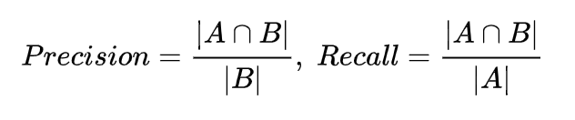
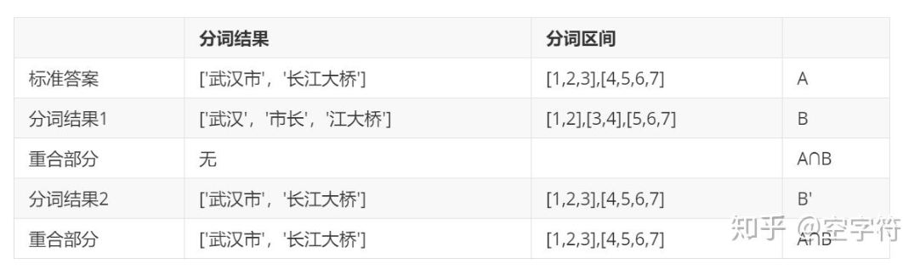
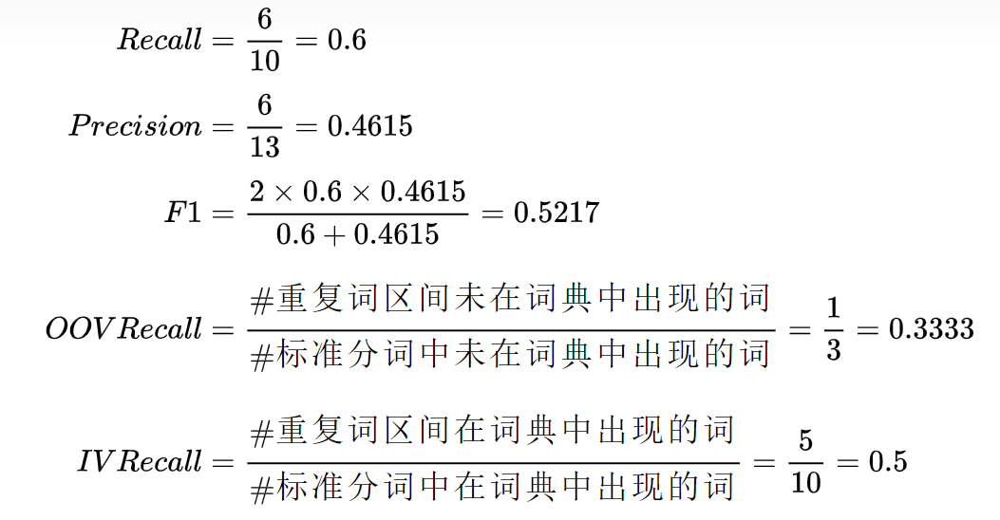

#分词任务的评估标准 

##1.结果准确率计算 
输出格式如下： 
+ y_true 
>扬 帆 远 东 做 与 中 国 合 作 的 先 行,B E B E S S B E B E S B E 
+ y_pred 
>扬 帆 远 东 做 与 中 国 合 作 的 先 行,B E S S S S B E B E S B E 

则结果准确率: 

##2.分词结果的精准率，召回率,F1值 
对于长为n的字符串，分词结果是一系列单词。 
设每个单词按照其在文中的起止位置可记作区间 [i,j]，其中 0<=i<=j<=n。 
那么标准答案所有区间构成集合 A作为正类，其它情况作为负类。 
同时，即分词结果所有单词构成的区间集合为B 。那么 

因此相应的计算公式如下： 

列举表格 

可以发现，重合部分就是正确部分； 
因此，对于分词结果1来说，精确率和召回率均为0，因为没有重合部分。 
而对于分词结果2来说都为1。下面再来看个例子： 

此时的精确率为：3/5=0.6 ，召回率为： 3/6=0.5 

## OOV IV 计算 
OOV指的是“未登录词”（Out Of Vocabulary）的简称，也就是新词，已知词典中不存在的词。 
出现OOV的原因一方面可能确实是因为产生了有意义的新词而词典并没有收录；另一方面可能就是因为分词器产生的错误无意义的分词结果，这当然也不会出现在字典中。 

IV指的是“登陆词”（In Vocabulary），也就是已经存在字典中的词。 
而OOV Recall和IV Recall 分别指的就是OOV的召回率和IV的召回率。 
为了说明这两个召回率的具体含义，请先耐心看下面的详细例子： 

标准分词 A：['结婚',' 的',' 和',' 尚未',' 结婚 ','的',' 都',' 应该',' 好好',' 考虑',' 一下',' 人生',' 大事'] 
标准区间 A：[1,2],[3,3],[4,4],[5,6],[7,8],[9,9],[10,10],[11,12],[13,14],[15,16],[17,18],[19,20],[21,22] 
分词结果 B：['结婚',' 的','和尚','未结婚 ','的 ','都',' 应该',' 好好考虑',' 一下',' 人生大事'] 
分词区间 B：[1,2],[3,3],[4,5],[6,7,8],[9,9],[10,10],[11,12],[13,14,15,16],[17,18],[19,20,21,22] 
重复词语 A∩B：['结婚',' 的',' 的',' 都',' 应该',' 一下'] 
重复区间 A∩B：[1,2], [3,3], [9,9],[10,10],[11,12],[17,18] 
词典：['结婚', '尚未', '的', '和', '青年', '都', '应该', '好好考虑', '自己', '人生', '大事'] 

---
>参考：[NLP中文分词的评估指标](https://zhuanlan.zhihu.com/p/100552669)
