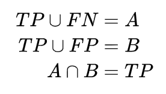

#分词任务的评估标准 

##1.结果准确率计算 
输出格式如下： 
+ y_true 
>扬 帆 远 东 做 与 中 国 合 作 的 先 行,B E B E S S B E B E S B E 
+ y_pred 
>扬 帆 远 东 做 与 中 国 合 作 的 先 行,B E S S S S B E B E S B E 

则结果准确率: 

##2.分词结果的精准率，召回率,F1值 
对于长为n的字符串，分词结果是一系列单词。 
设每个单词按照其在文中的起止位置可记作区间 [i,j]，其中 0<=i<=j<=n。 
那么标准答案所有区间构成集合 A作为正类，其它情况作为负类。 
同时，即分词结果所有单词构成的区间集合为B 。那么 

## OOV IV 计算 

---
>参考：[NLP中文分词的评估指标](https://zhuanlan.zhihu.com/p/100552669)
